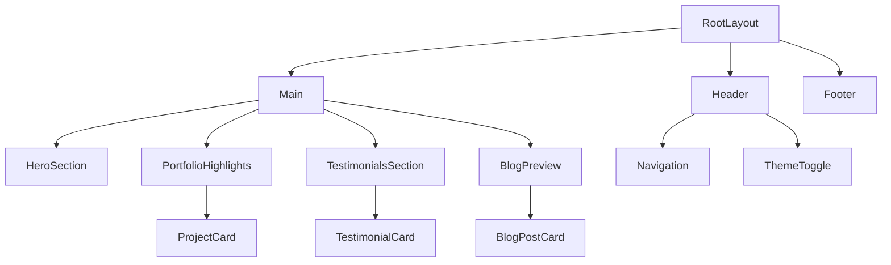

# Showcase Website Architecture Design

## Overview
This document outlines the architecture for a showcase website built with Next.js and deployed on Cloudflare Workers. The site features a unique "Cosmic Nexus" theme blending futuristic technology with nature's wonders, incorporating dynamic animations, interactive elements, real-time data, and performance optimizations.

## Theme: Cosmic Nexus
- **Visual Concept**: Space exploration meets bioluminescent ecosystems
- **Color Palette**: Deep space blues (#0a0a0f), neon cyans (#00ffff), organic greens (#00ff88), holographic purples (#8a2be2)
- **Typography**: Futuristic sans-serif (Geist Sans) with monospace accents (Geist Mono)
- **Imagery**: AI-generated cosmic landscapes, particle effects, 3D holographic elements

## Page Structure and Routing
- **Home (/)**: Landing page with hero section, portfolio highlights, testimonials, blog preview
- **Portfolio (/portfolio)**: Full portfolio grid with category filters and project details
- **Blog (/blog)**: Blog listing page with server-side rendered individual posts (/blog/[slug])
- **About (/about)**: Personal/professional information, skills showcase
- **Contact (/contact)**: Interactive contact form with validation

## Component Hierarchy

## Key Sections and Features

### Portfolio Highlights
- Interactive carousel/grid of featured projects
- Hover effects revealing project details
- Links to full portfolio page
- Technologies used badges

### Testimonials
- Rotating testimonial carousel
- Animated transitions between testimonials
- Client/company logos
- Star ratings

### Blog with Server-Side Rendering
- MDX-powered blog posts
- Server-side rendering for SEO
- Dynamic meta tags
- Related posts suggestions
- Reading time estimation

## Dynamic Animations and Interactive Elements
- **Page Transitions**: Smooth fade/slide transitions using Framer Motion
- **Scroll Animations**: Elements animate in on scroll using Intersection Observer
- **Hover Effects**: 3D transforms, glow effects, particle bursts
- **Interactive Background**: Animated particle system with mouse interaction
- **Loading States**: Skeleton loaders and progress indicators

## API Integrations
- **Weather API**: Real-time weather data using OpenWeatherMap API
  - Display current conditions and forecast
  - Location-based (geolocation or user input)
- **Analytics**: Real-time visitor analytics
  - Page views, user interactions
  - Custom events tracking
  - Integration with Cloudflare Analytics or Google Analytics

## Creative Touches
- **Particle Effects**: Interactive background particles using react-particles
- **3D Models**: Three.js integration for product showcases or decorative elements
- **AI-Generated Content**: Dynamic hero images generated via AI APIs
- **Holographic UI Elements**: CSS-based holographic effects for buttons/cards
- **Sound Design**: Optional ambient space sounds with user controls

## Responsive Design
- Mobile-first approach with Tailwind CSS
- Adaptive layouts for tablet and desktop
- Touch-friendly interactions
- Optimized typography scaling

## Performance Optimizations with Cloudflare Workers
- **Edge Computing**: API calls and data processing at the edge
- **Caching Strategy**: 
  - Static assets cached at edge
  - ISR for blog posts
  - R2 for image storage and caching
- **Image Optimization**: Next.js Image component with WebP/AVIF formats
- **Code Splitting**: Dynamic imports for heavy components (3D models, particle systems)
- **Lazy Loading**: Images and components loaded on demand
- **Compression**: Automatic gzip/brotli compression
- **CDN**: Global content delivery via Cloudflare's network

## Implementation Approach
1. **Setup**: Extend current Next.js + Cloudflare Workers setup
2. **Styling**: Tailwind CSS with custom theme configuration
3. **State Management**: React hooks for local state, Context for global
4. **Data Fetching**: Server Components for SSR, Client Components for interactivity
5. **Testing**: Unit tests with Jest, E2E with Playwright
6. **Deployment**: Automated CI/CD with Cloudflare Pages or Workers

## Technology Stack
- **Framework**: Next.js 15 (App Router)
- **Styling**: Tailwind CSS 4
- **Language**: TypeScript
- **Animations**: Framer Motion
- **3D Graphics**: Three.js + React Three Fiber
- **Particles**: react-particles
- **Deployment**: Cloudflare Workers via OpenNext
- **APIs**: OpenWeatherMap, Custom analytics endpoint

## Security Considerations
- Environment variables for API keys
- Input validation and sanitization
- Rate limiting for API endpoints
- HTTPS enforcement
- Content Security Policy headers

## Accessibility
- WCAG 2.1 AA compliance
- Keyboard navigation support
- Screen reader compatibility
- High contrast mode support
- Reduced motion preferences